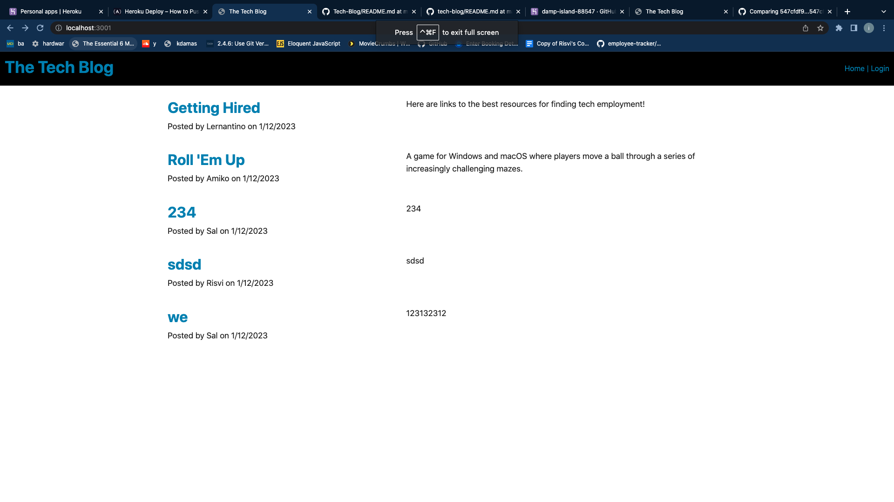

# Tech-Blog

## Description
This project uses the MVC structure to create a Tech Blog. It is unfinished as the new post and delete post functions work. The edit post, add comment, delete comment and edit comment do are not included.

## Table of Contents
<nav>
    <ol>
        <li><a href="#Installation">How to Use this Project</a></li>
        <li><a href="#Usage">Usage</a></li>
        <li><a href="#Credits">Credits</a></li>
        <li><a href="#Questions">Questions</a></li>
    </ol>
</nav>

## Installation
1) Create a folder locally to nominate for cloning from online repo
2) Clone with SSH by

git clone git@github.com:ivsir/Tech-Blog.git

3) Install the packages with 

npm i

4) Install MySQL and Insomnia for data base to work.

5) Change .env file to .example

## Usage
<a href="https://damp-island-88547.herokuapp.com/">This is the link to my WebPage</a>

## Credits
Risvi Tareq

## Questions
<li>https://github.com/ivsir </li>
<li>Email: ivsirqerat@gmail.com</li>